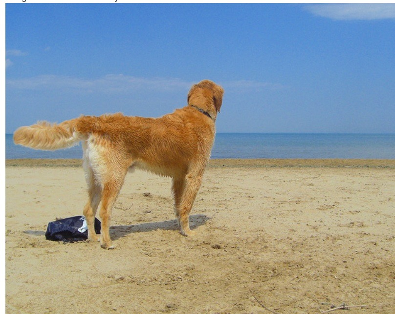

# Image Captioning using Few-Shot GPT

This repository contains code for generating captions for the Flickr8k dataset using a few-shot GPT model. The model is fine-tuned on the image and caption data from the Flickr8k dataset to generate more captions for the images. The generated captions are used to generate a text paragraph.

## Problem Statement

The problem is to generate captions for the images in the Flickr8k dataset and use them to create a text paragraph. The dataset can be downloaded from [this link](https://www.kaggle.com/datasets/adityajn105/flickr8k).

## Flow Diagram of the architecture

## Architecture Used

## How to Run

Follow the steps below to run the code:

1. Download the dataset from [this link](https://www.kaggle.com/datasets/adityajn105/flickr8k) and extract it.

2. Rename the extracted folder to "Data".

3. Install the dependencies by running the following command:

conda create --name new_environment_name --file requirements.txt

4. To train the model from scratch, run `train.py` to generate the weights (model). Alternatively, you can download the pretrained weights from [this Google Drive link](https://drive.google.com/drive/folders/1_VZB0SDfqN6c0QAUnG3Y3RoENAtF8Pii?usp=share_link).

5. Create your ChatGPT API key by visiting [this link](https://platform.openai.com/account/api-keys). Save and paste the API key in a file named `api_key.txt`.

6. For inference, i.e., to generate a paragraph given an image, run `infer.py`.

7. The sample output can be seen in `output.txt`.

Feel free to explore and modify the code to suit your needs!

## Results:
# For input image: 

car.jpg GT: A car splashes through mud and leaves on the forest floor
car.jpg OUTPUT: a blue race car is driving through a puddle on a track .
# more captions are

A race car is driving through a puddle on a wet track .
A blue car races around the track, its tires leaving a trail of water in its wake .
The blue race car zooms around the track, sending a splash of water with each turn .
A blue race car skids through a puddle on the track .
The blue car drives through a puddle on the track, leaving a wake of wetness behind it .
A blue race car is speeding around the track, splashing through a puddle .
# paragraph is

The blue race car is tearing around the track, its tires kicking up a spray of water as it passes through the puddle. The car skids through the wetness, leaving a trail of water in its wake. The driver is pushing the car to its limits, pushing the boundaries of speed and control. The car zooms around the track, sending a splash of water with each turn, leaving a trail of wetness behind it. The race car is a blur of blue and speed, pushing the limits of what is possible.

# For input image: 

child.jpg GT: Child holding red frisbee outdoors
child.jpg OUTPUT: a young boy is running through a grassy area .
# more captions are

    A young boy sprinting through a green meadow .
    A young boy running through a field of lush grass .
    A small child running through a grassy field .
    A young boy running joyfully through a grassy field .
    A small boy running through a grassy area with a smile on his face .
    A young boy running with enthusiasm through a grassy landscape .
# paragraph is

The sun shone brightly in the sky as a young boy sprinted through the green meadow below. His face beamed with joy as he ran through the field of lush grass, a small child full of energy and life. His smile grew wider as he ran joyfully through the grassy field, his little feet barely touching the ground. The wind flew through his hair as he ran with enthusiasm through the grassy landscape, the young boy feeling a sense of freedom and joy. He felt alive and free, running through the field with a smile on his face.

# For input image: 

dog.jpg GT: Dog on a beach by the ocean
dog.jpg OUTPUT: a dog is running through the water .
# more captions are

A dog is splashing through the waves on the beach.
A golden retriever is running through the shallow water.
A black lab is joyfully running through the ocean.
A wet dog is running happily through the waves.
A pup is running through the water with its tongue out.
A canine is running and playing in the water.
# paragraph is

The beach was alive with activity on a beautiful summer day. A golden retriever, black lab, and pup all ran and played in the waves, joyfully splashing through the ocean. The pup ran with its tongue out, happily running through the shallow water. The canine ran through the waves, its fur wet with sea-salt. The three dogs were having the time of their lives, running and playing in the waves. It was a sight to behold, and a reminder of the joy that can be found in even the simplest of activities.

# For input image: 

boat.png GT: A small boat in the ocean
boat.png OUTPUT: a man is rowing a boat on a foggy day .
# more captions are

    A man rows a boat through the misty morning air .
    A man rows a boat through the foggy lake .
    A rower navigates a boat on a cloudy day .
    A man rows a boat through the foggy waters .
    A man rows a boat in a hazy morning .
    A man rows a boat through the fog-covered lake .
# paragraph is

The misty morning air was filled with a thick fog, making it difficult to see the lake ahead. The man in the boat was undeterred, navigating the boat steadily as he rowed through the cloudy day. The hazy morning was illuminated by glimmers of sunlight peeking through the fog-covered lake. He moved slowly through the foggy waters, his oar cutting through the stillness as he made his way through the lake. As he continued his journey, the fog began to dissipate, revealing a beautiful landscape ahead.

# For input image: 

football.jpg GT: A red team and a white team are playing football
football.jpg OUTPUT: a football player in a red uniform is tackling the player in red .
# more captions are

    output -A football player in a red uniform is aggressively tackling the player in white .
            Two football players in red uniforms are tackling each other in a heated game .
            A football player wearing a red uniform is attempting to make a tackle on the opposing player in red .
            The football player in red is tackling the other player in a red uniform .
            A football player in a red uniform is tackling the player with the ball .
            The football player in red is bringing down the other player wearing a red uniform .
# paragraph is

The heated game between the two teams is culminating in a fierce battle for the ball. The football player in red is aggressively tackling the player in white, determined to take possession. His teammates are also joining in, as two players in red uniforms are tackling each other. The player in red is attempting to make a tackle on the opposing player in red, and is succeeding in bringing him down. The player in red is also tackling the player with the ball, determined to take possession. The football player in red is bringing down the other player wearing a red uniform, showing his determination to win the game. It's a fierce battle for the ball, and the player in red is determined to come out on top.

